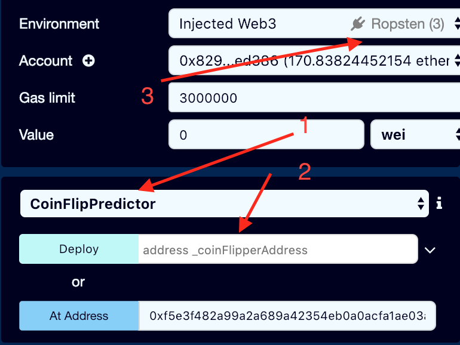
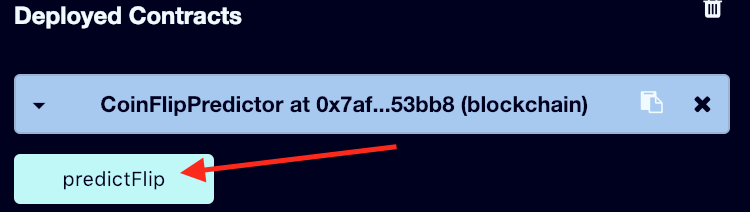

# Level 3

The goal of this level is to figure out how to beat the random number generator. In computer programs the best any program can do is pseudo-random generators. Looking at this particular algorithm it doesn't look very good.

What i realized in this assignment is that you couldn't just do it through the chrome dev tools. What you needed was a contract that called this contract. It should use the same number generation algorithm when calling Coinflip contract so that no matter which block my transactions were mined in they would always guess correctly. This is only possible because when one contract calls another it is done in a single transaction/block. 

I ended up switching to using Remix Web IDE for solidity. It allowed me to write a contract while interacting with deployed contracts on ropsten. In this repo i have included my conflipperpredictor.sol. It also contains the interface for CoinFlip.sol so I would be able to correctly call the ABI methods easily in the IDE.
```
instance //copy returned value
```

Look at screenshot I have included. 
1) make sure to select coinflipperpredictor here
2) paste the instance public address here
3) make sure you are on ropsten network

Once you have deployed the contract called the `predictFlip()` function in remix. Once the function returns back a result from the network run it again. Do this 10 times. Now go back to the chrome dev tools and see how many consecutive wins you have. You should have 10 wins. 


Done, now you just need to submit the instance.


## Notes:
- before i understood how transactions between smart contracts worked i was trying to:
  - watch the last mined blocked on etherscan ropsten network and make sure i triggered transactions where i knew the result (this didn't work)
  - tried trigger 10 transactions in 1 block hoping i would get all of them correct at once