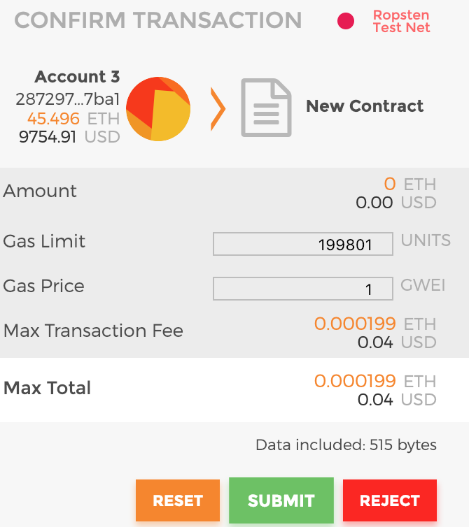

# Level 4 - Telephone

The goal of this level is to take over the deployed smart contract. Like level 3 this level requires you to write a smart contract which calls the currently deployed smart contract. How this solution works is that you need to build a smart contract that takes in `telephone.sol` contracts and calls the changeOwner method on telephone. It appears like the `tx.origin` variable and the `msg.sender` are going to be different. One of them is going to be the address of our custom contract while the other will be our player/instance address. I think what this level is teaching is that don't assume that person who is calling your method is a person, it can be another contract.

In this folder you will find a .sol file i used in remix to call Telephone.sol

Just for fun here is a picture of metamask deploying my telephone contract
